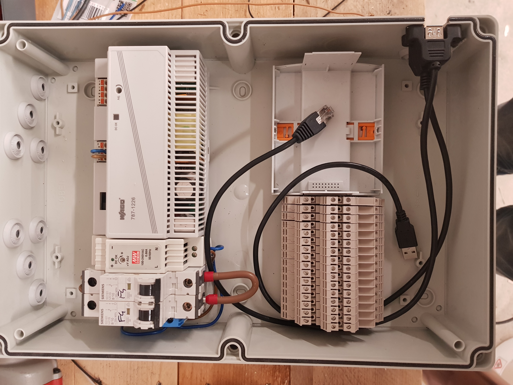
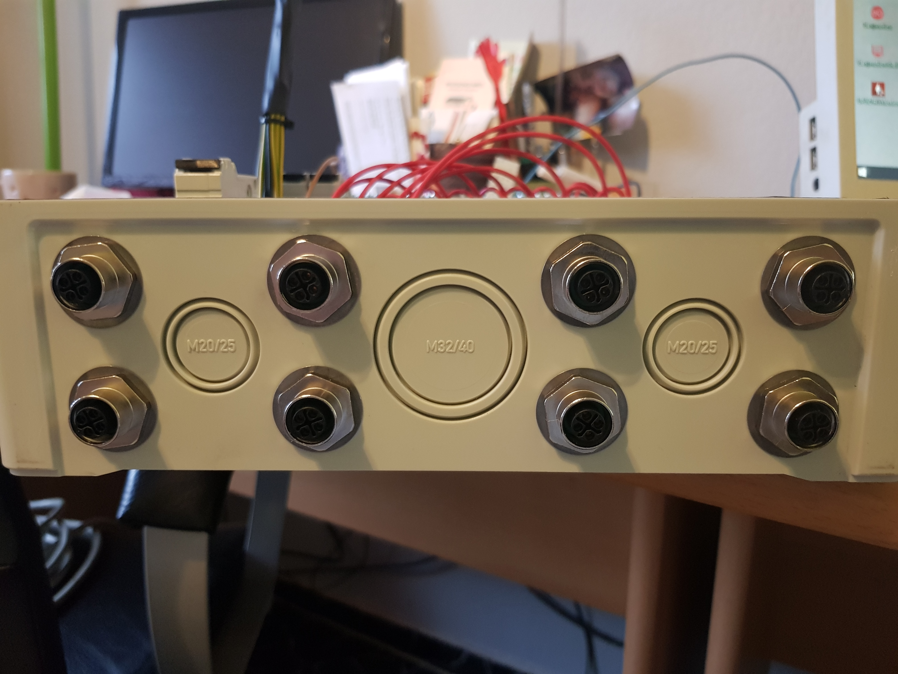
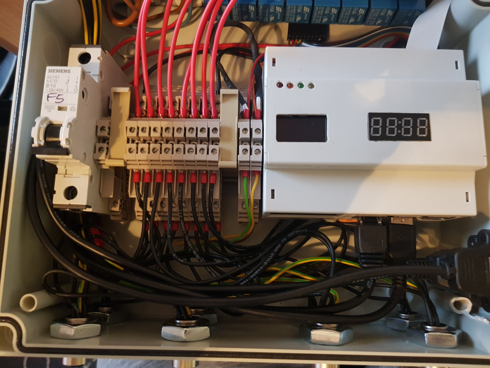
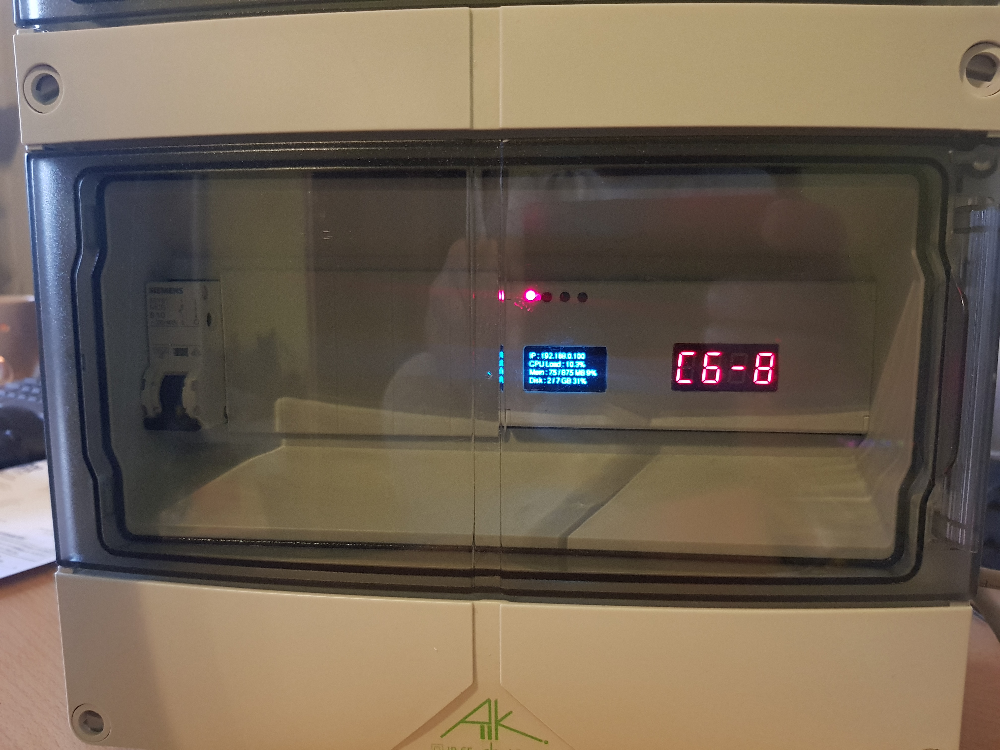

# Overview of used and built in hardware

## Casing
* [Spelsberg AK24 | 73542401](https://www.spelsberg.de/nc/produkt/an/73542401/)

## Raspberry Pi
* [Raspberry Pi 3 Model B](https://www.amazon.de/Raspberry-Pi-Model-ARM-Cortex-A53-Bluetooth/dp/B01CD5VC92)
* micro SD card 8GB
* [Cooler and fan](https://www.amazon.de/gp/product/B07JGNF5F8/ref=ppx_yo_dt_b_asin_title_o02_s02?ie=UTF8&psc=1)
* Raspberry Pi housing
    * [RPI-BC 107,6 DEV-KIT KMGY | 2202874](https://www.phoenixcontact.com/online/portal/de?uri=pxc-oc-itemdetail:pid=2202874&library=dede&tab=1)
* [OLED DisplayIC2 096" 128x64](https://www.amazon.de/gp/product/B00NHKM1C0/ref=ppx_yo_dt_b_asin_title_o04_s00?ie=UTF8&psc=1)
    * to display state and several values
* [4 digits 7 segment display IC2](https://www.amazon.de/AZDelivery-Digital-Display-Arduino-Raspberry/dp/B06X952QXS/ref=pd_rhf_ee_p_img_12?_encoding=UTF8&refRID=175F6J4SEV7W0YBYNSCF&th=1)
    * to show time, state, channel
* [Camera module](https://www.amazon.de/gp/product/B07CMXJLXR/ref=ppx_yo_dt_b_asin_title_o08_s00?ie=UTF8&psc=1)

## Power supply Raspberry Pi
* [Indexa DR1505,  5VDC  max. 2,4A | 32212](https://www.indexa.de/w2/datenblatt/32212_datenblatt.pdf)

## Power supply 24VDC for valves
* [Wago EPSITRON COMPACT Power, 24VDC 6A | 787-1226](https://www.wago.com/de/stromversorgungen/primaer-getaktete-stromversorgung/p/787-1226)

## Relay card to control valves
* [i.e. any 8 channel low level relay modul 5VDC](https://www.amazon.de/8-Kanal-Optokoppler-8-Channel-Arduino-Raspberry/dp/B00AEIDWXK)
    * [also this ](https://www.amazon.de/gp/product/B01C2IN2U2/ref=oh_aui_detailpage_o00_s00?ie=UTF8&psc=1)
    * [or this](https://www.amazon.de/gp/product/B07CT7SLYQ/ref=ppx_yo_dt_b_asin_title_o02_s00?ie=UTF8&psc=1)

## Power connectors, plugs and sockets for valves
* [Socket Phoenix Contact 1411605](https://www.phoenixcontact.com/online/portal/de?uri=pxc-oc-itemdetail:pid=1411605&library=dede&tab=1)
* [Plug Phoenix Contact 1404641](https://phoenixcontact.de/online/portal/de/?uri=pxc-oc-itemdetail:pid=1404641&library=usen&pcck=P-20-07-06-01&tab=2&selectedCategory=ALL)

## Moisture and temperature sensor
* [DHT22 AM2302](https://www.amazon.de/gp/product/B07CMXJLXR/ref=ppx_yo_dt_b_asin_title_o08_s00?ie=UTF8&psc=1)

## Adapter and output connectors
* [Network adapter RJ45](https://www.amazon.de/gp/product/B07CMXJLXR/ref=ppx_yo_dt_b_asin_title_o08_s00?ie=UTF8&psc=1)
    * to get network connection outside the main casing
* [USB 2.0 adapter](https://www.amazon.de/gp/product/B07CMXJLXR/ref=ppx_yo_dt_b_asin_title_o08_s00?ie=UTF8&psc=1)
    * to get an USB connection outside the main casing

## Some impressions
Please refer other [images](./images) also!

